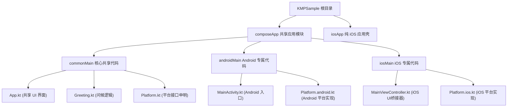

# 🚀 KMPSample - 跨平台移动端应用项目说明书

你好！👋 欢迎来到 **KMPSample** 跨平台开发项目！这是一个基于 **Kotlin Multiplatform (KMP)** 和 **Compose Multiplatform** 构建的移动端应用程序。通过本工程，我们只需要编写一份代码，就可以同时在 **Android** 和 **iOS** 平台上运行精美的用户界面和业务逻辑！

作为一个精通 Android 开发的“技术大哥哥”，我会用最通俗易懂的语言，带你一步步探索这个神奇的跨平台世界。

---

## 📂 项目结构概览 (Project Architecture)

在这个项目中，Kotlin 代码被巧妙地划分成了共享区域和平台特定区域：



*   **`composeApp` (共享应用模块)**: 核心文件夹。90% 的界面和业务逻辑都在这里。
    *   `commonMain`: **所有平台共享的代码**。这里的代码在 Android 和 iOS 上都会运行！
    *   `androidMain`: **Android 专属代码**。只有当打包 Android 应用时才会编译这部分。
    *   `iosMain`: **iOS 专属代码**。只有在打包 iOS 应用时才会编译。
*   **`iosApp` (iOS 外壳工程)**: 这是一个标准的 Xcode 工程，专门用来将我们的共享库包装成一个真正的 iOS App。

---

## 🛠 已实现的核心功能与 API 说明

本项目目前实现了两个非常有趣且基础的功能：**个性化问候** 与 **运行平台检测**。下面我们来看看它们是如何工作的：

### 1. 平台检测功能 (`Platform` 机制)
通过 Kotlin 的 `expect` (期望) / `actual` (实际) 机制，我们在不同的手机系统上获取不同的系统版本信息。

*   **定义接口 (`Platform.kt`)**:
    ```kotlin
    interface Platform {
        val name: String // 平台的名称
    }
    expect fun getPlatform(): Platform // 这是一个“期望”函数，每个平台都必须实现它
    ```
*   **Android 端实现 (`Platform.android.kt`)**:
    *   **用途**: 获取当前 Android 手机的 SDK API 版本。
    *   **返回值**: 返回 `AndroidPlatform` 实例，其中 `name` 属性形如 `"Android 34"`（代表 Android 14 系统）。
*   **iOS 端实现 (`Platform.ios.kt`)**:
    *   **用途**: 获取当前 iPhone 手机的系统名称和版本。
    *   **返回值**: 返回 `IOSPlatform` 实例，其中 `name` 属性形如 `"iOS 17.2"`。

### 2. 问候语功能 (`Greeting.kt`)
*   **类名**: `Greeting`
*   **核心方法**: `fun greet(): String`
    *   **参数**: 无
    *   **用途**: 结合当前的运行平台，生成一句温馨的欢迎词。
    *   **返回值说明**: 返回一个格式为 `"Hello, [平台名称]!"` 的字符串。例如，在 Android 模拟器上运行会返回 `"Hello, Android 34!"`。

### 3. 主界面布局 (`App.kt`)
*   **组件名称**: `App()`
*   **技术框架**: Compose Multiplatform (Material Design 3 风格)
*   **界面布局**:
    1.  背景使用系统主容器色 (`MaterialTheme.colorScheme.primaryContainer`)，安全区域自适应 (`safeContentPadding()`)。
    2.  包含两个精美的按钮：
        *   **"Click me!" 按钮**: 点击后会像魔术一样弹出 Compose 标志性图片和由 `Greeting().greet()` 生成的问候语，并带有平滑的动画效果。
        *   **"显示平台信息" 按钮**: 点击后会从下方滑出当前设备运行的操作系统版本 (如 `"当前平台: Android 34"` 或 `"当前平台: iOS 17.2"`)。

---

## 🚀 如何运行和部署应用

你可以直接使用自带的 **Android CLI** 命令行工具，或者使用 Gradle 命令行快速编译和启动应用。

### 1. 使用 Android CLI 工具 (推荐 💡)

Android CLI 工具能帮助你非常方便地管理和启动虚拟设备：

*   **列出已安装的 Android SDK 及工具**:
    ```shell
    android sdk list
    ```
*   **查看当前已连接的设备或正在运行的模拟器**:
    ```shell
    adb devices
    ```
*   **列出可用的安卓虚拟设备 (AVD)**:
    ```shell
    android emulator list
    ```
*   **一键运行应用到设备**:
    ```shell
    android run
    ```

### 2. 使用原生 Gradle 命令编译

如果你想直接从终端构建 APK 安装包：

*   **在 macOS / Linux 上编译安卓 Debug 版本**:
    ```shell
    ./gradlew :composeApp:assembleDebug
    ```
*   **在 Windows 上编译安卓 Debug 版本**:
    ```shell
    .\gradlew.bat :composeApp:assembleDebug
    ```
    编译成功后，生成的 APK 文件将位于：`composeApp/build/outputs/apk/debug/composeApp-debug.apk`。

---

## 🎨 我们的下一步开发计划！

太棒了！我们已经完全初始化了项目，并了解了它的骨架。接下来，我们可以根据 **Material Design 3** 规范，结合本地数据库 **Room** 和强大的依赖注入框架 **Hilt**，开启更多炫酷功能的开发！

你希望我们接下来一起做点什么呢？比如：
1.  📝 **超级任务清单 (Todo List App)**: 学习如何使用 Room 数据库保存你的每日任务，并使用 Material 3 动效卡片展示！
2.  ☀️ **炫彩天气预报 (Weather App)**: 学习如何进行网络请求，展示伴随动感背景的实时天气。
3.  🧮 **拟物化计算器 (Premium Calculator)**: 制作一个带精美按键微动效、支持历史记录保存的计算器。

期待你的选择！让我们一起在 Android 跨平台的世界里快乐地探险吧！🚀